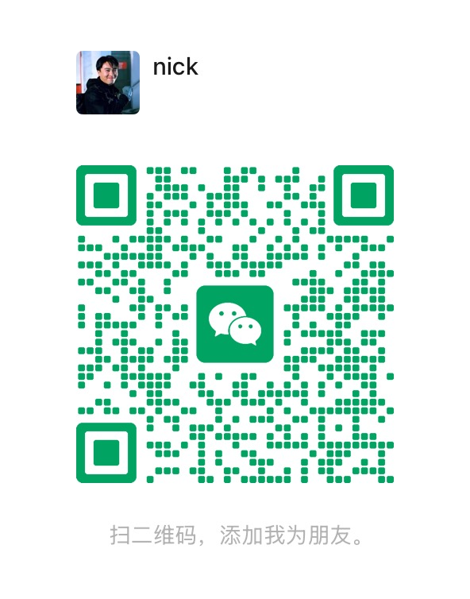

# Codex 公共 Skills

这是一组可复用的 Codex skills，用于项目治理、任务交接、发布验证、高风险检查、后端工程和事故经验沉淀。

这些 skills 刻意保持通用：只包含流程、模板、检查清单和脚本，不包含任何具体项目的业务上下文、账号、服务器、部署目标或私密记录。

## 包含的 Skills

- `project-governance`：初始化项目协作文件，降低长会话上下文依赖，维护交接摘要。
- `release-validation`：在任务完成前定义验收标准、运行相关验证，并说明已测试/未测试内容。
- `quality-gates`：针对高风险变更选择检查项，例如权限、表单、日期、通知、迁移、集成、部署和生产数据。
- `backend-engineering`：后端工程护栏，覆盖 API、schema、持久化、权限、通知、外部集成和部署。

## 这套体系覆盖什么

它不是某一句 prompt，而是一套 Codex 协作操作系统。

- 项目记忆：稳定事实放进 `PROJECT_CONTEXT.md`，不靠聊天历史硬记。
- 当前任务：长任务状态放进 `ACTIVE_TASK.md`。
- 会话交接：可恢复状态放进 `SESSION_SUMMARY.md`。
- 问题复盘：真实事故和回归经验放进 `CODING_NOTES.md`。
- 发布纪律：完成前定义验收标准，并提供验证证据。
- 风险门禁：对高风险区域增加专门检查。
- 后端契约：把 API、schema、数据库、权限、日志和副作用放在一起检查。

其中 `CODING_NOTES.md` 很关键。它负责把问题变成下次的检查项：

- Symptom / 现象：发生了什么。
- Root Cause / 根因：为什么发生。
- Missed Check / 漏检：什么检查本可以发现。
- Prevention / 预防：下次要搜索、测试或验证什么。

## 安装

把 skills 复制到 Codex 的 skills 目录：

```bash
mkdir -p "${CODEX_HOME:-$HOME/.codex}/skills"
cp -R skills/* "${CODEX_HOME:-$HOME/.codex}/skills/"
```

然后重启 Codex，或开启一个新会话，让 Codex 重新发现这些 skills。

## 推荐用法

新项目开始时，可以对 Codex 说：

```text
Init_project
```

这会使用 `project-governance` 创建缺失的项目协作文件，例如：

- `AGENTS.md`
- `PROJECT_CONTEXT.md`
- `SESSION_SUMMARY.md`
- `ACTIVE_TASK.md`
- `CODING_NOTES.md`
- `SECRETS.local.md`

已有文件默认不会被覆盖。敏感本地文件会被加入 `.gitignore`。

长任务、跨文件任务或准备开启新会话时，可以说：

```text
Handoff
```

这会更新 `ACTIVE_TASK.md` 或 `SESSION_SUMMARY.md`，让新会话不必依赖完整聊天记录也能继续工作。

如果出现回归、验证遗漏或真实事故，把可复用经验写入 `CODING_NOTES.md`。以后修改相关逻辑前，Codex 会先读这些已知失败模式。

## 内置脚本

`project-governance` 内置了两个确定性的辅助脚本。

初始化项目治理文件：

```bash
python3 "${CODEX_HOME:-$HOME/.codex}/skills/project-governance/scripts/init_project_governance.py" /path/to/project
```

更新当前任务交接：

```bash
python3 "${CODEX_HOME:-$HOME/.codex}/skills/project-governance/scripts/update_handoff.py" active /path/to/project \
  --goal "..." \
  --acceptance "..." \
  --file "..." \
  --command "..." \
  --finding "..." \
  --next-step "..."
```

更新会话交接摘要：

```bash
python3 "${CODEX_HOME:-$HOME/.codex}/skills/project-governance/scripts/update_handoff.py" summary /path/to/project \
  --current-state "..." \
  --recent-change "..." \
  --decision "..." \
  --open-item "..." \
  --next-step "..."
```

## 公共与项目边界

公共 skill 只放可复用的方法和流程；真实项目事实应该留在项目文件里。

不要提交：

- 凭证、API key、token、密码、私钥
- 生产服务器信息
- 客户、患者或用户隐私数据
- 私密事故证据
- 本地部署笔记

## 交流

如果你也在研究 Codex skills、AI 编程工作流，或者想聊聊怎么把 AI agent 用得更像工程同事，欢迎加我微信交流。



## 许可证

MIT
